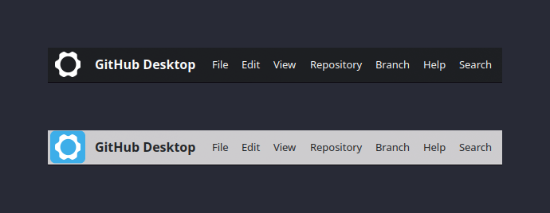
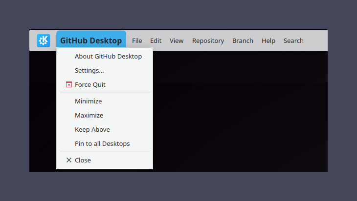
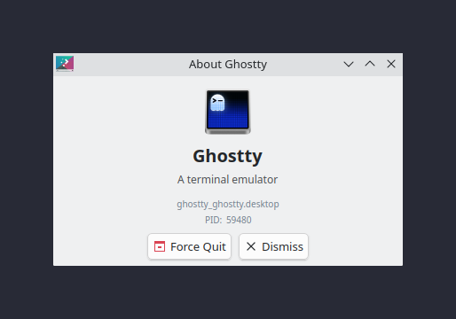
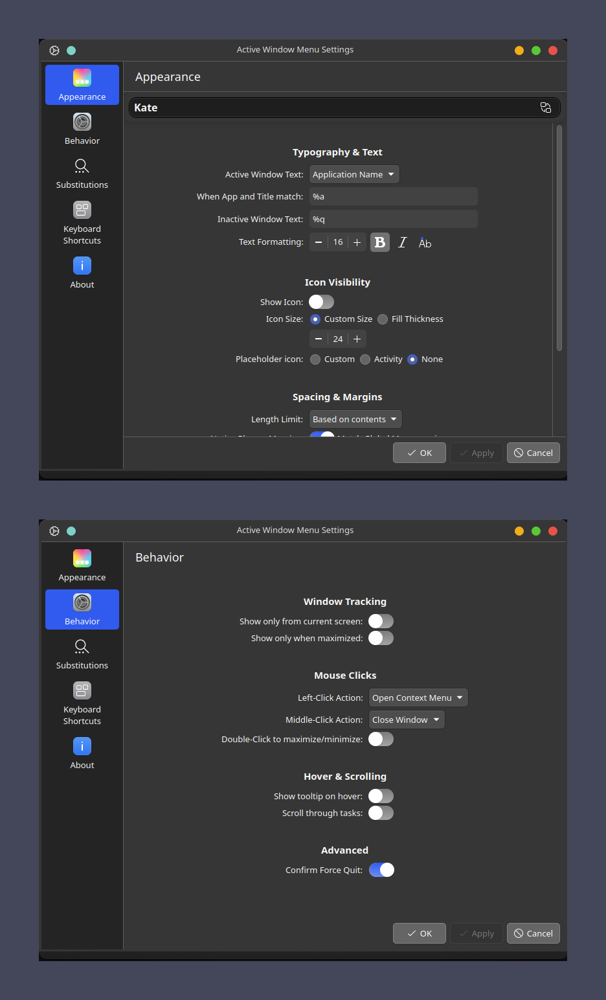

# Active Window Menu
<p align="center">
  
</p>
<p align="center">
  <a href="https://store.kde.org/p/2362989/">
    
  </a>
  <a href="https://ko-fi.com/ajxcodes">
    
  </a>
</p>

A Mac-like window title and context menu applet built natively for KDE Plasma 6.

## Features
- **Mac-Style App Menu**: Left-click the active window's title in the panel to open a native context menu with window management actions (Minimize, Maximize, Close, Keep Above, etc.).
- **Smart App Menu Heuristics**: Dynamically traverses D-Bus AppMenu trees with candidate scoring to expose application-specific "Preferences/Settings" and "About" actions directly in the menu.
- **Native Plasma 6 Architecture**: Built on `PlasmaExtras.Menu` to ensure robust Wayland support, focus management, and flawless C++ backend integration.
- **Pixel-Perfect Aesthetic & Alignment**: Mathematically centered layouts, 2px tight vertical panel margins, fine-grained vertical text offset, and system font size matching.
- **Monochrome & Inactive Display Options**: Toggle monochrome symbolic icons to match panel styling, and optionally hide inactive window text on single-activity setups.
- **Dynamic Substitutions**: Highly customizable text display using variables like `%a` (App Name) and `%w` (Window Title).

## Credits & Acknowledgments
This project was heavily refactored and expanded from the fantastic foundational work of:
- **[Dhruvesh Surolia](https://github.com/dhruv8sh/plasma6-window-title-applet)** (who ported the original concept to Plasma 6)
- **[Psifidotos](https://github.com/psifidotos)** (creator of the original Active Window Control applet)

## Substitutions
- **%a** : Application Name
- **%w** : Window Title
- **%q** : Activity Name
- `<b>`..`</b>` : Selective bold
- `<i>`..`</i>` : Selective Italics
- `<br>`/`<p>` : New line ([Text will not be elided with multi-line text](https://bugreports.qt.io/browse/QTBUG-16567))

## Images
<div align="center">
<p>

<br/>
<i>Hover states across different Plasma themes</i>
<br/><br/>
</p>

<p>

<br/>
<i>Context menu with window management actions</i>
<br/><br/>
</p>

<p>

<br/>
<i>About page</i>
<br/><br/>
</p>

<p>

<br/>
<i>Applet Settings (Appearance, Behavior, Substitutions, Keyboard Shortcuts)</i>
<br/><br/>
</p>

</div>

## Installation

### Via KDE Store (Recommended)
You can easily install this directly through your Plasma Desktop:
1. Right-click your panel and select **Add Widgets...**
2. Click **Get New Widgets...**
3. Search for **Active Window Menu** and hit install!

Alternatively, if you are viewing this on a system with KDE Discover installed, you can use an AppStream link (if you have your store ID):
[Install via Discover](appstream://com.ajxcodes.active-window-menu) or [View on KDE Store](https://store.kde.org/p/2362989/)

### Manual Installation
If you've cloned this repository, you can easily install and test it using the provided script:
```bash
./install.sh
```
*Note: This script copies the contents to `~/.local/share/plasma/plasmoids/com.ajxcodes.active-window-menu` and automatically restarts the Plasma shell.*

Alternatively, you can build and install it using Plasma's native package tool:
```bash
kpackagetool6 -t Plasma/Applet -i ./
```
